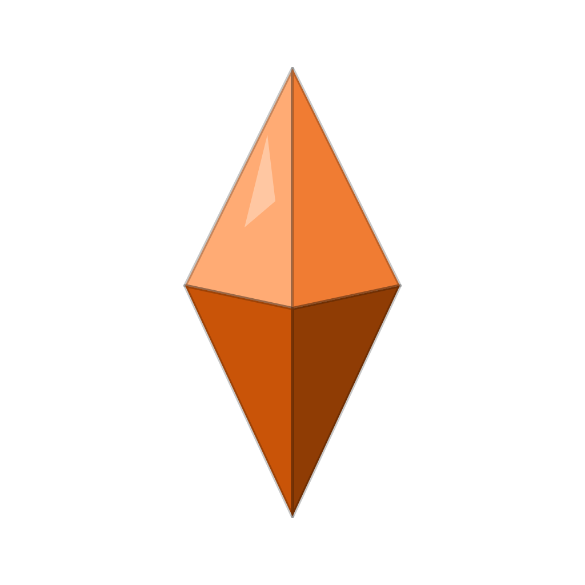

  

<h1 align="center">Oxidean</h1>

  Building the next generation of development tooling.

  <a href="https://oxidean.dev">oxidean.dev</a> ·
  <a href="https://app.oxidean.dev">Oxidean Cloud</a> ·
  <a href="mailto:contact@oxidean.dev">contact@oxidean.dev</a>

## What we do

Oxidean builds development tooling you can run yourself. Our first product is a
self-hostable forge for social coding — git hosting, issues, organizations,
releases, and package registries — that ships as one codebase for
[Oxidean Cloud](https://app.oxidean.dev) and for Docker Compose on your own
machines.

## Projects

| Project | What it is |
|---------|------------|
| [`oxidean/oxidean`](/oxidean/oxidean) | Our self-hostable forge — web UI, API, and services (Bun + Rust monorepo) |
| [`oxidean/.github`](/oxidean/.github) | This profile and the org-wide default community health files |

## Around the org

- **Site:** [oxidean.dev](https://oxidean.dev)
- **Product:** [app.oxidean.dev](https://app.oxidean.dev) — hosted Oxidean Cloud
- **Contributing:** each repo's own guide wins; the org-wide defaults live in
  [this repo](/oxidean/.github)
- **Security:** [SECURITY.md](/oxidean/.github/blob/main/SECURITY.md) — report
  privately, never in public issues
